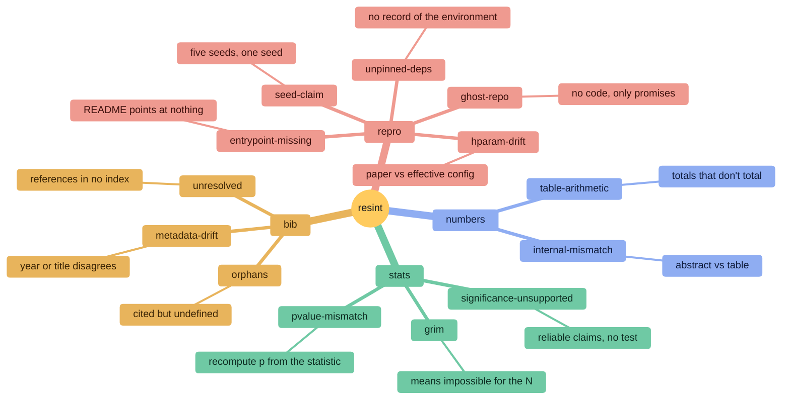

# resint

[](https://github.com/ArjunSharma06/resint/actions/workflows/ci.yml)
[](https://pypi.org/project/resint/)
[](https://pypi.org/project/resint/)
[](LICENSE)

**A linter for research papers.** It reads a paper the way a compiler reads
code — and reports what does not add up.

```console
$ resint check paper.tex --repo ./code

  high  ✓ numbers/internal-mismatch      Results:L23 <-> table1:r2c1:L35
        Results reports accuracy of 94.2, but table1 reports 93.8 for the same
        quantity (column holds 91.4, 93.8). A revised table with an unrevised
        claim looks exactly like this.

  high  ✓ repro/hparam-drift             Method:L13 <-> configs/base.yaml:L3
        learning rate is 3e-4 in the paper, but a run would use 1e-4 from
        configs/base.yaml. Resolved through argparse default in train.py
        (3e-4) -> configs/base.yaml (1e-4).

  high  ✓ repro/seed-claim               claim:L14 <-> train.py:L31
        The paper reports results over 5 runs, but the repository fixes a
        single seed (42) in 3 places and never varies it.
        affects: every error bar downstream of this claim

   med  ✓ bib/unresolved                 [zhang2023].doi:L18
        The DOI 10.5555/9999999 does not resolve, and no index returned a
        matching record.

  11 findings (4 high, 5 med, 2 low) · 1.8s · no API key used
```

**No API key. No account. No dependencies.** Most of resint is arithmetic,
parsing, and HTTP. It runs offline in about two seconds.

Every check here needs **ground truth outside the text** -- a live index, an
actual repository, or arithmetic over the precision the paper itself reported.
That is why reading the paper closely, however carefully, does not substitute
for it: you cannot tell by reading whether a DOI resolves, whether t(20)=2.086
really gives p=.03, or whether the config a run would load matches the one the
methods section describes.

---

## Who it's for

| | What you get |
|---|---|
| **Writing a paper** | Catch the inconsistencies before a reviewer does. Run it on your draft the way you run a spellchecker. |
| **Submitting** | The stale abstract number, the citation that does not resolve, the config that no longer matches your methods section. |
| **Reviewing** | A five-minute read of a submission's statistics and bibliography. Runs fully offline, so nothing confidential leaves your machine. |
| **Reading** | Before you spend an afternoon on someone's repository, find out whether its numbers, links, and hyperparameters agree with the paper. |

It works on any field. The statistics and bibliography rules assume nothing
about your discipline; the `repro/` rules assume you have code.

## Install

```console
pipx install resint      # Python 3.11+, no other dependencies
```

## Quickstart

```console
resint check paper.tex                       # the paper alone
resint check paper.tex --repo ./code         # paper against its code
resint check paper.tex --offline             # no network at all
resint check paper.tex --format sarif        # GitHub code scanning
resint rules                                 # what it checks, and what it misses
resint init                                  # write a .resint.yml
```

Exits non-zero when a high-severity finding is present, so it drops into CI
without a wrapper.

---

## What it checks



| Rule | Catches | Needs |
|---|---|---|
| `numbers/internal-mismatch` | The abstract and the results table disagree about one value | |
| `numbers/table-arithmetic` | Stated totals that do not equal the entries above them | |
| `stats/pvalue-mismatch` | A reported *p* that the test statistic does not produce | |
| `stats/grim` | A mean arithmetically impossible for the stated *N* | |
| `stats/significance-unsupported` | Claims of reliability with no test anywhere in the paper | |
| `bib/unresolved` | A DOI that resolves nowhere — the fabricated-citation signal | network |
| `bib/doi-mismatch` | A DOI that resolves **to a different paper** | network |
| `bib/metadata-drift` | Entries whose year disagrees with the canonical record | network |
| `bib/orphans` | Keys cited with no entry, entries never cited | |
| `bib/unindexed` | No DOI and no title match. Off by default | network |
| `repro/hparam-drift` | The paper's hyperparameters against the ones a run would use | `--repo` |
| `repro/seed-claim` | "Averaged over five seeds" when the code fixes one | `--repo` |
| `repro/entrypoint-missing` | README commands pointing at files that do not exist | `--repo` |
| `repro/ghost-repo` | A linked repository holding no code | `--repo` |
| `repro/unpinned-deps` | Nothing recording the environment the results came from | `--repo` |

`resint rules` prints each rule's blind spots. **Every rule declares what it
cannot detect**, and that limitation travels with the finding into JSON and
SARIF output.

### How well each rule works

Not published yet, and that is deliberate. Every number this project has
reported so far is a **robustness** number -- no crashes, no anchor failures,
every rule executed. Those say the plumbing works; they say nothing about
whether the findings are right.

The two rules whose precision was actually checked were **both wrong every
time they fired**. `stats/pvalue-mismatch` produced three findings on real
papers, all three the authors' rounding read as their error.
`numbers/table-arithmetic` produced two, both columns of independent rates
mistaken for partitions. Five findings, five false positives. That is the
strongest available argument for not publishing the rest until they are
measured.

Measurement is underway (`tools/review.py`), and each rule will carry four
numbers: how often it fires, **findings per paper**, precision with a Wilson
interval, and the sample size behind it. Rules below the bar get narrowed,
downgraded, or turned off by default, and the changelog will say which --
because narrowing a rule silently orphans anyone's suppressions.

Every rule also has a **planted case** — a document built so that rule must
fire. A rule that stays silent on real papers may be correct and rare, or
silently broken, and no amount of corpus separates those: it gives you a
larger zero. The planted case is what does.

---

## The two ideas

### Findings are evidence, not opinions

A finding says *"Results line 23 reports 94.2; table 1 row 2 column 1 reports
93.8."* There is nothing left for you to verify.

Every finding carries **at least two anchors**, enforced at construction — not
by convention, by the type system:

```python
Finding(anchors=[claim_span])                    # raises AnchorError
Finding(anchors=[claim_span, evidence_span])     # a comparison you can check
```

One anchor is an assertion you have to go and check. Two make it a comparison
you can verify by reading the finding itself. That difference is the product.

The `✓` marks a finding as **computed** rather than judged.

### You can run it twice

A finding's identity is its **fingerprint** — built from the rule and the
content it is about, never from line numbers. Add a paragraph to your
introduction and every line below it moves; the fingerprints do not. So a
second run shows what is genuinely new rather than reporting the whole paper
again.

And a judgement can be written beside the line it excuses:

```latex
ibitem{knuth1984}  % resint: ignore bib/unindexed -- a textbook, no DOI
```

The reason is required. A suppressed finding is still produced, still counted,
and still in the JSON with its reason — so a suppression can never hide a
regression.

### It tells you what it could not check

*"No findings"* and *"did not look"* are different statements, and a tool that
conflates them is worse than useless.

```
  unchecked: table3 not checked: row widths disagree ([3, 4])
  unchecked: mean at line 57 not checked: 2 sample sizes in the same sentence
  unchecked: 5 references could not be looked up (offline); not reported as missing
```

---

## How it works


Every character of the intermediate representation remembers where it came
from, so a finding that says `line 98` means line 98 of *your* file.

Rules declare what they need, and the engine builds only that. A run whose
rules never declare `paper.resolutions` **never opens a socket** — laziness is
the privacy mechanism, not a separate flag.

---

## Precision over coverage

A rule that stays silent one time in five where it should have spoken is a
good rule. A rule that speaks wrongly one time in twenty is a liability. This
tool tells people something is wrong with their work, and a single confident
false accusation costs more trust than a hundred correct findings earn.

So resint abstains — loudly — wherever it cannot be sure:

- A mean is checked only when **exactly one** sample size sits in its sentence.
- A reference is reported missing only when the indices were actually reached.
  **A lookup that fails is never a finding.**
- A prose value is compared to a table cell only when it is *near* one. A
  distant value is a different quantity, not a stale number.
- A hyperparameter is compared only when the repository yields **one**
  effective value. Two configs disagreeing at the same precedence level means
  a run's actual value cannot be known.
- A seed read from an argument or set inside a loop counts as varying, even
  though the source shows one call.
- A table whose grid did not parse is skipped and reported, never guessed at.

---

## Configuration

```yaml
# .resint.yml
suppress:
  - rule: bib/metadata-drift
    match: "[vaswani2017]"
    reason: "Cites the proceedings version deliberately."
    expires: "2027-01-01"

rules:
  stats/grim: off        # no integer-scale response data in this work
```

**Every suppression states a reason.** This file is the record of each
judgement made about the work, and a silenced finding with no explanation is
unauditable six months later. Suppressed findings still appear in JSON and
SARIF marked with their reason, so a suppression can never hide a regression.

## Privacy

resint runs entirely on your machine. The only network access is reference
resolution, which sends the **titles and DOIs of works your paper already
cites publicly**. The manuscript itself is never transmitted. `--offline`
disables even that, and the reference rules abstain rather than guess.

---

## Documentation

| | |
|---|---|
| [docs/rules.md](docs/rules.md) | Every rule, what it catches, what it cannot detect |
| [docs/architecture.md](docs/architecture.md) | The IR, the rule engine, the pipeline |
| [docs/configuration.md](docs/configuration.md) | `.resint.yml` in full |
| [docs/rule-authoring.md](docs/rule-authoring.md) | How to write a rule, and the bar it has to clear |
| [CHANGELOG.md](CHANGELOG.md) | What shipped, when |

## Bring your own model (optional)

Thirteen rules are arithmetic and need nothing. Six more read a paper against
itself, and against the papers it cites:

| Rule | Catches |
|---|---|
| `bib/citation-support` | You cite [42] for something [42] contradicts |
| `claim/overreach` | "Significantly outperforms", by three tenths of a point |
| `eval/baseline-fairness` | Your method got four times the training budget |
| `claim/scope-creep` | "Across diverse domains", meaning two datasets |
| `claim/unimplemented` | A claimed capability with no trace in the repository |
| `claim/unsupported` | An abstract promising what the paper never returns to |

These need a model, and **you bring it** — resint has no key and no account,
and with none configured every one of these is skipped and *reported as
skipped*, never silently passed.

```yaml
# .resint.yml
model:
  provider: groq          # or openai, gemini, deepseek, openrouter, ollama
  name: openai/gpt-oss-120b
```

The key comes from the environment (`GROQ_API_KEY`, `OPENAI_API_KEY`,
`GEMINI_API_KEY`, …), **never from this file** — it is committed alongside
your paper. Ollama runs locally, needs no key, and sends nothing anywhere.

**The model never renders the verdict, and never returns a position.** It
returns a verbatim quote; code finds the offset. Never the reverse -- a model
asked for character positions produces plausible ones that are wrong and
nothing downstream can tell, while a model asked to quote produces text that
either appears in the source or does not, which code settles exactly. Found
once it anchors; found zero times or three, it is discarded. So a hallucination
cannot become a finding — and neither can an instruction
injected into a paper, because invented text cannot supply the second anchor
every finding requires.

Answers are cached to disk, so checking the same paper twice costs one set of
calls. And model findings **do not fail your build** unless you pass
`--fail-on-model`: they involve judgement, and a misfire there should not cost
the thirteen deterministic rules your trust.

## Status

**Early — v0.1.** Nineteen rules — thirteen deterministic, six
model-assisted. The API is not stable yet.

The model tier is new and its precision is still being measured. It will be
reported **per model, with a range** when it is, because a local 8B and a
frontier model are different instruments and one averaged number across them
would be dishonest.

Found a false positive? [That's the most valuable issue you can
open](https://github.com/ArjunSharma06/resint/issues) — each one becomes a
regression fixture.

## Licence

Apache-2.0.
