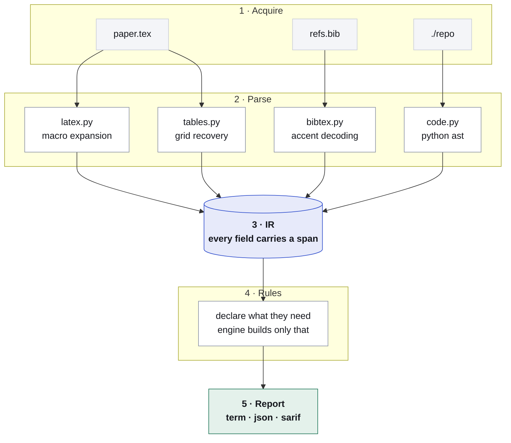

# Architecture

Five stages, one library. Everything decides in the library; the CLI parses
arguments and formats what comes back.



## The IR is the product

A rule being twenty lines is evidence the IR is good, not evidence the rule is
trivial. The hard engineering lives here:

- **LaTeX macro expansion** with a truthful offset map
- **Table grid recovery** from `tabular`, including `multicolumn`
- **BibTeX accent decoding** — `{\'E}tude` → `Étude`, folding to `Etude` for
  index search
- **Config precedence** — resolving argparse defaults, YAML layering and Hydra
  composition to the value a run would *actually* use

```python
class Paper:
    text          TextSlice     # prose + the mapping back to source
    sections      list[Section]
    tables        list[Table]   # cells[row][col], anchored
    numbers       list[Number]  # value, label, section, span
    means         list[ReportedMean]
    stats         list[StatTest]
    hyperparameters list[Number]
    citations     list[Citation]
    bib           list[BibEntry]
    resolutions   dict          # key -> Resolution

class Repo:
    files         list[str]
    symbols       list[Symbol]
    configs       ConfigSet     # + precedence resolution
    seeds         list[SeedCall]
    deps          list[Dependency]
    entrypoints   list[Entrypoint]
```

## Spans, not strings

Every element carries `(source, start, end)`. Claims are spans, never
strings — a string match degrades silently the moment anything upstream
paraphrases, and a finding that has lost its anchor cannot be re-run, diffed,
or labelled for the corpus.

This is why `paper.tex:L98` means line 98 of *your* file, not line 98 of some
intermediate the tool invented.

## Declared requirements

```python
@rule(requires=["paper.stats"])
def check(ctx):
    ctx.paper.stats     # fine
    ctx.paper.tables    # AttributeError
```

The context exposes exactly what `requires` lists. Two things fall out:

**Laziness is enforceable.** The engine builds only the slices some rule asked
for. A run whose rules never declare `paper.resolutions` never constructs a
resolver and **never opens a socket** — privacy by construction rather than by
a flag someone has to remember.

**Tests stay small.** A rule's tests only stand up the slice it declared,
which is what keeps rule number fourteen cheap to contribute.

## Data carries its own resolution

Where a rule needs both a collection and the logic over it, the two travel
together as **one** declared attribute:

| Attribute | Carries |
|---|---|
| `paper.text` | prose **and** the span mapping back into source |
| `repo.configs` | every declared value **and** precedence resolution |

The gate works on attribute names. A rule forced to declare `repo.effective`
alongside `repo.configs` would be naming an implementation detail rather than
what it needs.

## Rules read; they never write

The IR is immutable inside a rule. When a rule declines to check something —
ambiguous config precedence, an unreadable table — it calls
`ctx.abstain(reason)`, and the engine collects those alongside the findings.

Silence without a stated reason is indistinguishable from a pass.

## Three outcomes, not two

Reference resolution is the only part of the deterministic tier that touches
the network, so it is the only part that can fail for reasons unrelated to the
paper.

| Outcome | Meaning | Can it produce a finding? |
|---|---|---|
| `FOUND` | The record exists | Yes |
| `NOT_FOUND` | Every index was queried and none had it | Yes |
| `UNKNOWN` | The query failed — offline, rate-limited, timed out | **Never** |

Collapsing `UNKNOWN` into `NOT_FOUND` would report a reference as fabricated
because the network was down. That is the worst bug this tool could ship, so
the distinction is enforced at the type level rather than left to each rule.

## Surfaces

```
                    ┌─────────────────┐
                    │  resint library │
                    └────────┬────────┘
                             │
        ┌──────────┬─────────┼─────────┬──────────┐
       CLI      Action     MCP*    editor*      web*
```

`cli.py` contains no analysis. That is what keeps surface two a thin file
rather than a rewrite — the SARIF writer, the terminal writer and the JSON
writer all consume the same `Report` with no rule-specific branches between
them.

<sub>* not built yet</sub>

## Layout

```
src/resint/
├── ir/          Span, Finding, Paper, Repo — the contract
├── parse/       latex, bibtex, tables, code, configs → IR
├── rules/       one file per rule, discovered by walking
├── resolve/     reference lookup behind a protocol
├── report/      term, json, sarif
├── mathx/       incomplete beta and gamma, so no scipy
├── engine.py    rule selection and execution
├── config.py    .resint.yml
└── cli.py       thin
corpus/          fixtures: positive and negative
tools/           doc generation
```
